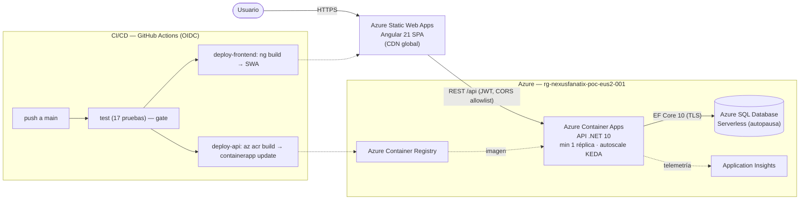
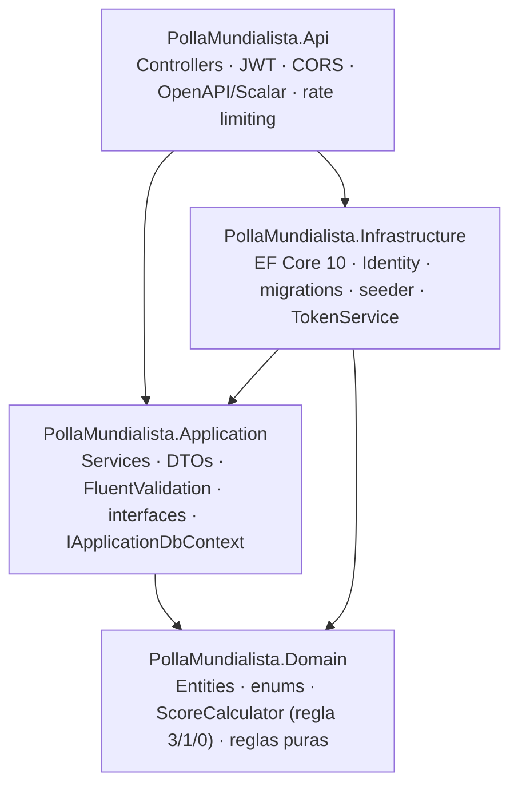

# Arquitectura — Polla Mundialista

## 1. Vista de despliegue (lo que está en producción)

**Orígenes separados** (SWA y Container Apps) → la API aplica **CORS con allowlist** del dominio del SWA (nunca `*`).

## 2. Capas del backend (Clean Architecture pragmática — sin CQRS)

Regla de dependencias: siempre hacia adentro. `Infrastructure` implementa las interfaces
declaradas en `Application` (`IApplicationDbContext`, `IAuthService`, `ITokenService`).
El `Domain` no conoce EF ni Identity (las predicciones referencian al usuario por `string`).

**¿Por qué sin CQRS?** El dominio es chico (~8 operaciones). CQRS sería sobre-ingeniería;
el layering permite introducirlo si el dominio crece.

## 3. Por qué escala (4 palancas)

1. **JWT stateless** → sin sesión en servidor → escalado horizontal trivial.
2. **CDN en el edge** (SWA) → estáticos cerca del usuario, API descargada.
3. **API stateless + autoscaling KEDA** (Container Apps) → réplicas según carga.
4. **DB serverless** → autoescala vCores y autopausa sin tráfico (costo ~0 en reposo).

## 4. Camino de crecimiento (evolución, no implementado)

- **Azure Cache for Redis** para cachear el leaderboard.
- **Azure Front Door** para ruteo global / WAF.
- **Bicep** para IaC reproducible del stack completo.
- **Microsoft Entra External ID** como identidad federada (reemplazo del JWT propio).

## 5. Seguridad (resumen)

- JWT (claims `sub`/`email`/`role`, expiración configurable), hashing de Identity.
- `[Authorize(Roles="Admin")]` en endpoints admin; rate limiting en `/auth/*`.
- CORS allowlist; HTTPS en el ingress; validación server-side (FluentValidation).
- **Anti-trampa**: no se exponen predicciones ajenas de partidos no iniciados (§5.5).
- Secrets fuera del repo: variables de entorno / Container App secrets (connection
  string, JWT secret, App Insights). Evolución: Azure Key Vault.

Ver también: [ERD](erd.md).
