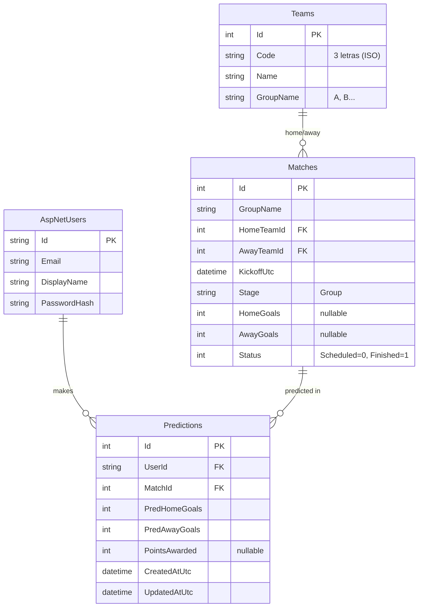

# Modelo de datos (ERD)

## Constraints e índices

- Roles vía Identity (`AspNetRoles`): `Admin` y `User`, sembrados.
- `Predictions`: índice **único** `(UserId, MatchId)` → una predicción por usuario/partido.
- `Teams.Code`: índice único (3 letras).
- `Matches.Status`: enum (`Scheduled=0` / `Finished=1`), persistido como `int`.
- FKs `Matches.HomeTeamId` / `AwayTeamId` → `Teams.Id` con `DeleteBehavior.Restrict`
  (no se puede borrar un equipo con partidos).
- FK `Predictions.MatchId` → `Matches.Id` y `Predictions.UserId` → `AspNetUsers.Id`,
  ambas en cascada.
- Todas las fechas se guardan en **UTC**; el front formatea a hora local.

## Datos semilla

- **Grupo A y B reales del Mundial 2026** (8 equipos): MEX · RSA · KOR · CZE (grupo A) y
  CAN · BIH · QAT · SUI (grupo B) → round-robin de 6 partidos por grupo = **12 partidos**,
  con emparejamientos y kickoffs reales (UTC) entre el 11 y el 25 de junio de 2026.
- La **jornada 1** de cada grupo viene precargada como jugada (4 partidos `Finished`, con
  marcadores ilustrativos) para poblar el leaderboard en la demo; los 8 restantes quedan
  abiertos para predecir.
- 5 usuarios demo con predicciones de ejemplo (ver credenciales en el README).
- **Re-seed auto-sanador**: si la base trae un set de equipos distinto al esperado, se
  reemplazan teams/matches/predictions al arrancar, de modo que un nuevo deploy actualiza
  el seed del entorno ya desplegado.
